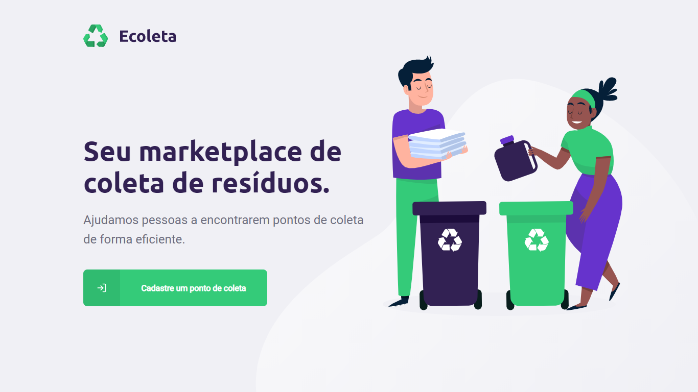
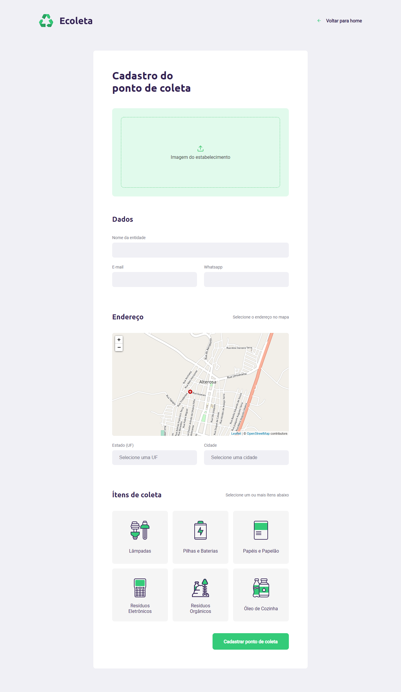
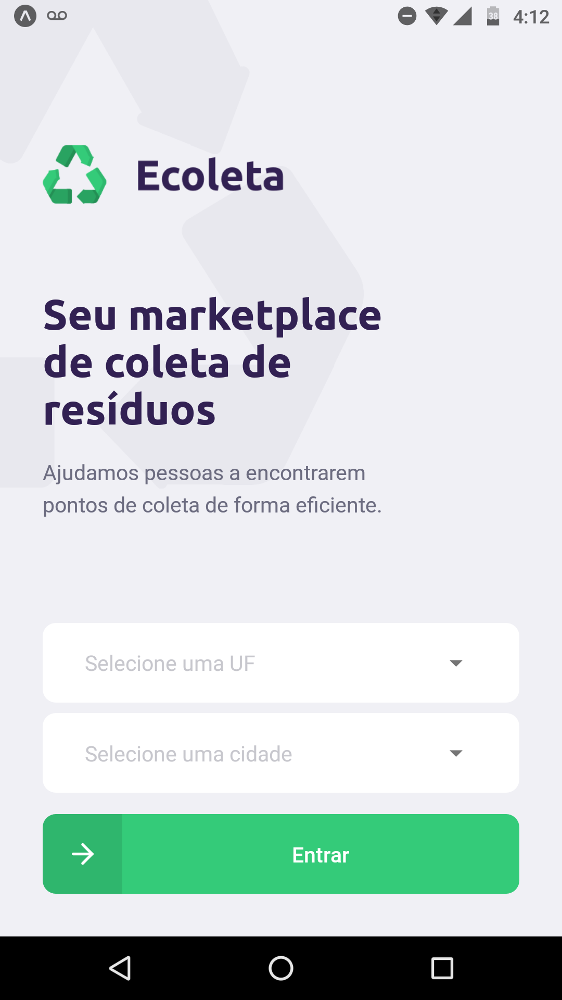
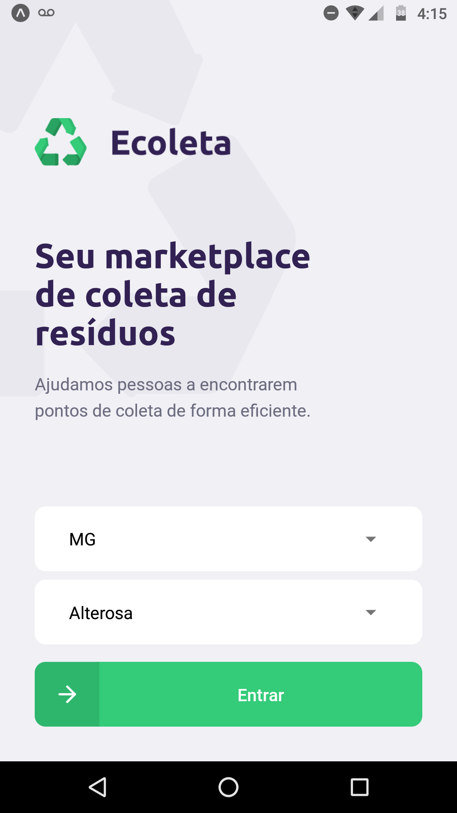
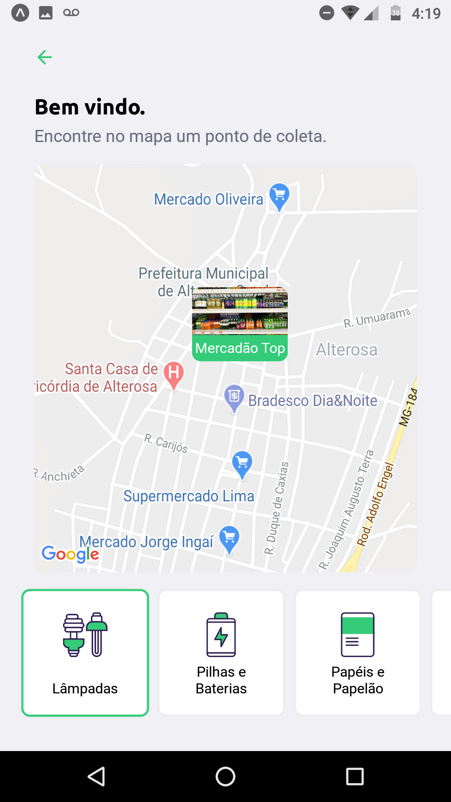
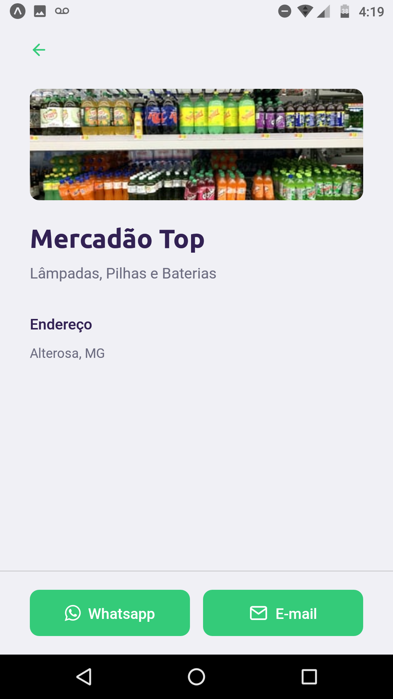

<h1
    align="center"
    style="color: #4ECB79;"
>
    📲 eColeta: O jeito mais fácil de lidar com descarte de resíduos ♻
</h1>

<h3
    style="color: #3DBA68;"
>
    Está com dificuldades para lidar com o descarte de resíduos? Sejam eles orgânicos, elétricos ou de diversos outros tipos, a gente resolve o problema para você. O eColeta é um rastreador de pontos de coleta por GPS que te permite filtrar a busca de acordo com os tipos de resíduos que você desejar.
</h3>

Desenvolvido durante a Next Level Week 1 (evento realizado pela Rocketseat), o eColeta permite o cadastramento tanto de pontos de coleta pela aplicação web, como a busca de pontos de coleta através da aplicação mobile.

<h4>🛠 Tecnologias e ferramentas: 🛠</h4>
<ul>
    <li>TypeScript</li>
    <li>Node.JS e Knex</li>
    <li>ReactJS</li>
    <li>React Native</li>
    <li>Expo CLI</li>
</ul>

<h4>📑 Recursos adicionais: ⌨</h4>
<ul>
    <li>Validações no backend com <strong>Celebrate</strong></li>
    <li>Tratamento de upload de imagens no backend com <strong>Multer</strong></li>
    <li>Tratamento de upload de imagens no frontend com <strong>React Dropzone</strong></li>
</ul>

<h4>📷 Capturas de tela: 📷</h4>
<table>
    <tr><td align="center"><strong>Aplicação web</strong></td></tr>
    <tr>
        <td>
            
        </td>
    </tr>
    <tr>
        <td>
            
        </td>
    </tr>
</table>

<table>
    <tr><td colspan="2" align="center"><strong>Aplicação mobile</strong></td></tr>
    <tr>
        <td>
            
        </td>
        <td>
            
        </td>
    </tr>
    <tr>
        <td>
            
        </td>
        <td>
            
        </td>
    </tr>
</table>